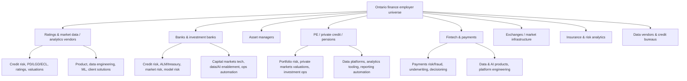

# Ontario Finance and Financial-Tech Employer Universe (ARCHIVAL)

> **Status (as of 2026-05-03):** Archival research layer. Superseded by `Target_Companies_2026.md` (the curated shortlist) and `job_tracker_data.json` (the live pipeline). Broken `citeturn***` and `entity[...]` tokens have been stripped. Keep for reference only; do not use as an active targeting source. If you want to explore employer categories not covered in the shortlist, start here.

## Executive summary

This report builds a practical target universe of finance-focused employers with a material presence in entity["state","Ontario","province canada"]—especially entity["city","Toronto","ontario canada"] / GTA—where it is *plausible* they have more than 10 employees in Ontario. Because “employees in Ontario” is rarely disclosed publicly at the firm level, Ontario headcount is treated as a **likelihood signal** derived from (a) explicit Ontario office listings and/or (b) evidence of ongoing hiring for Ontario-based roles on official career sites or entity["company","LinkedIn","professional network"] job listings. Examples of explicit Toronto office listings include S&P Global listing its Toronto office in Bay Adelaide Centre East Tower, 22 Adelaide Street West citeturn28view0 and Fitch listing its Toronto office and describing a new Toronto office expansion citeturn26search3turn26search6.

The highest-fit targets for a CFA with Moody’s-style analytics experience and hands-on production AI/product engineering typically cluster in these areas: (a) **ratings, market data, and analytics vendors**, (b) **large banks and capital-markets platforms**, (c) **pensions/private markets investors**, and (d) **financial market infrastructure and “plumbing” firms** (clearing/settlement, fund servicing, payments rails). These are the settings where credit/risk/portfolio work and data/AI/product engineering naturally converge (e.g., S&P Global’s offices and hiring in Toronto citeturn28view0turn26search12; Moody’s Toronto office presence citeturn8search11; BlackRock’s Toronto contact details and Aladdin-related Toronto roles citeturn30search2turn30search16; major Canadian banks headquartered in Toronto citeturn37search12turn21search0turn21search2turn0search10).

## Research approach and evidence standards

Ontario presence was validated using two “primary” evidence types:

**Office/location evidence (preferred):** Official “contact us” or “office locations” pages that explicitly list Ontario offices and addresses (e.g., S&P Global office locations page listing Toronto citeturn28view0; MSCI support page listing a Toronto office address citeturn29search0; FactSet locations listing Toronto citeturn29search1; Nasdaq Canada contact listing a Toronto office citeturn8search5; Morningstar DBRS contact listing Toronto HQ citeturn18search2).

**Hiring evidence:** Official career pages with Toronto/Ontario job filters, or public LinkedIn job-search pages indicating active hiring for Ontario roles (e.g., CI Financial Toronto job search citeturn22search4; Stripe job search filtered to Toronto citeturn25search2; Equifax Toronto vacancies page citeturn17search0).

**Likely Ontario headcount >10** is a *classification*, not a measured statistic:
- **Y** = strong signal (HQ/major office in Ontario, multiple Ontario locations, or substantial Ontario hiring footprint).
- **Unverified** = Ontario presence is clear, but “>10 in Ontario” cannot be confidently inferred from public evidence.
- **N** = used sparingly; typically only if a firm has only minimal/ambiguous Ontario evidence (these were mostly excluded rather than listed).

Country labels use the user’s requested buckets: **Canadian / US / International**. entity["country","Canada","country"] is the geographic frame for “Canadian” headquarters and Ontario operations across all tables.

## Category map and role-fit logic

The target universe is organized by the categories you specified. The key idea is that your profile (CFA + credit/risk/portfolio domain + production AI/product delivery) tends to fit best where **finance decisioning** is tightly coupled to **data platforms, models, and workflow software**.

## Master table

### Canadian companies

| Company name | Country | Primary sector/category | Ontario locations | Evidence of Ontario presence (office page, LinkedIn hiring/jobs) | Likely Ontario headcount >10? | Relevant teams/roles to target (2–4) | Career page URL (hyperlinked) | Finance/analytics-relevant description | Priority score (1–5) |
|---|---|---|---|---|---|---|---|---|---|
| entity["company","Royal Bank of Canada","canadian bank"] | Canadian | Asset manager / bank (multi-line) | Toronto | Corporate presence and diversified financial-services footprint citeturn37search12turn1search19 | Y | Credit risk analytics; Model risk / validation; Capital markets data/AI; Product (risk/analytics) | Careers citeturn0search0 | Diversified financial services firm spanning banking, wealth, insurance, investor services, and capital markets citeturn37search12 | 5 |
| entity["company","Toronto-Dominion Bank","canadian bank"] | Canadian | Asset manager / bank (multi-line) | Toronto | Corporate office listed in Toronto citeturn21search0 | Y | Credit/treasury risk; Market risk tech; Data engineering; AI automation in risk/ops | Careers citeturn0search1 | Large North American bank with major Canadian banking and capital-markets operations anchored in Toronto citeturn21search0turn0search1 | 5 |
| entity["company","Bank of Montreal","canadian bank"] | Canadian | Asset manager / bank (multi-line) | Toronto | Toronto corporate address evidence citeturn21search12 | Y | Credit risk; Wealth/capital markets analytics; Data/AI product; Automation for regulatory reporting | Careers citeturn0search4 | Major Canadian bank with broad banking/wealth/capital-markets activities and a substantial Toronto footprint citeturn21search12turn0search4 | 4 |
| entity["company","Scotiabank","canadian bank"] | Canadian | Asset manager / bank (multi-line) | Toronto | Corporate HQ address in Toronto citeturn0search10 | Y | Credit & portfolio risk; Retail/wholesale risk analytics; Model governance; Data engineering | Careers citeturn0search3 | Large bank with Toronto headquarters and wide-ranging banking and capital-markets roles citeturn0search10turn0search3 | 4 |
| entity["company","Canadian Imperial Bank of Commerce","canadian bank"] | Canadian | Asset manager / bank (multi-line) | Toronto | Headquarters listed as 81 Bay St, Toronto citeturn21search2 | Y | Capital markets risk/analytics; Derivatives tech; Model risk; Data/AI automation | Careers citeturn2search14turn19search14 | Major Canadian bank headquartered in Toronto with large-scale capital markets and risk/tech hiring citeturn21search2turn19search14 | 4 |
| entity["company","Equitable Bank","canadian bank"] | Canadian | Bank / fintech-adjacent lender | Toronto | Careers page lists Toronto head office (EQ Bank Tower) citeturn24search0 | Y | Credit risk & underwriting analytics; Treasury/ALM; Data science; Risk platform product | Careers citeturn24search4turn24search0 | Toronto-headquartered challenger bank with roles spanning portfolio/treasury and technology citeturn24search0turn24search4 | 4 |
| entity["company","Questrade Financial Group","canadian brokerage"] | Canadian | Fintech / brokerage | Toronto | “About”/careers content indicates HQ capacity and Toronto presence citeturn6search1 | Y | Investment operations analytics; Risk & controls; Data engineering; Product analytics | Careers citeturn6search4turn6search1 | Canadian online brokerage and wealth platform with a sizable Toronto headquarters footprint citeturn6search1turn6search4 | 3 |
| entity["company","Interac","canadian payments network"] | Canadian | Fintech/payments | Toronto | Contact/careers footprint indicates Toronto presence and platform focus citeturn5search16turn37search5 | Y | Payments risk; Data/AI product; Platform/data engineering; Identity/verification analytics | Careers citeturn5search15turn37search5 | Canadian payments and verification platform positioned as core financial infrastructure and digital verification leader citeturn37search5turn37search17 | 4 |
| entity["company","Moneris","canadian payments company"] | Canadian | Fintech/payments | Toronto | Toronto office contact details and Toronto-based working model citeturn5search7turn5search19 | Y | Payments analytics; Fraud/risk; Data engineering; Product management (merchant/payments) | Careers citeturn5search19 | Major Canadian payments processor with Toronto office presence and payments/merchant analytics opportunities citeturn5search7turn5search19 | 3 |
| entity["company","TMX Group","canadian exchange operator"] | Canadian | Exchanges/infra | Toronto | Careers site references offices including Toronto; TMX operates markets and analytics solutions citeturn37search6turn37search10 | Y | Capital markets data/analytics; Market risk/controls; Data engineering; Product (market infrastructure) | Careers citeturn37search6 | Operates global markets and builds digital communities and analytic solutions supporting funding, trading, and investing citeturn37search10turn37search6 | 4 |
| entity["company","Fundserv","canadian investment infrastructure"] | Canadian | Exchanges/infra (investment ops rails) | Toronto | Toronto address on contact page; careers site available citeturn20search1turn20search5 | Y | Investment ops analytics; Data engineering; Platform product; Automation of fund processing | Careers citeturn20search9turn20search5 | Connectivity hub for the Canadian investment industry with technology services reducing operational cost/time/risk citeturn20search17turn20search1 | 4 |
| entity["company","Aviso Wealth","canadian wealth platform"] | Canadian | Asset manager / wealth infrastructure | Toronto | Careers page lists Toronto contact address and current Toronto opportunities citeturn36search0turn36search4 | Y | Wealth platform analytics; Data/AI automation; Product management; Risk/controls | Careers citeturn36search0turn36search4 | Wealth-management platform employer with Toronto HQ contact details and active Ontario recruiting citeturn36search0turn36search4 | 4 |
| entity["organization","Ontario Teachers' Pension Plan","canadian pension plan"] | Canadian | PE/private credit/pension | Toronto | Toronto head office contact info with careers link citeturn3search0 | Y | Private markets analytics; Portfolio risk; Valuations; Data platforms / AI enablement | Careers citeturn3search0 | Large Toronto-based pension investor with institutional portfolio and private markets teams suited to analytics + tech | citeturn3search0 | 5 |
| entity["organization","HOOPP","canadian pension plan"] | Canadian | PE/private credit/pension | Toronto | Toronto head-office evidence and dedicated careers page citeturn3search2turn35search16 | Y | Investment analytics; Risk management; Data engineering; Ops automation | Careers citeturn35search16 | Defined-benefit pension organization with Toronto presence and structured careers portal citeturn35search16turn3search2 | 4 |
| entity["organization","OPTrust","canadian pension plan"] | Canadian | PE/private credit/pension | Toronto | Corporate office in downtown Toronto; careers states primary office in Toronto citeturn24search2turn24search6 | Y | Private markets analytics; Portfolio reporting automation; Risk; Data platform roles | Careers citeturn24search6 | Pension investor/administrator with Toronto as primary office and private markets footprint citeturn24search6turn24search2 | 4 |
| entity["organization","CAAT Pension Plan","canadian pension plan"] | Canadian | PE/private credit/pension | Toronto | Toronto mailing address and active Toronto hiring evidence citeturn24search3turn24search15 | Y | Pension analytics; Finance transformation; Data/BI engineering; Ops modernization | Careers citeturn24search7 | Toronto-based pension plan with visible Toronto hiring footprint and modernized finance/ops roles citeturn24search7turn24search15 | 4 |
| entity["company","Brookfield Asset Management","canadian alternative asset manager"] | Canadian | PE/private credit/pension (alternatives) | Toronto | Toronto contact presence and global careers portal citeturn4search2turn4search1 | Y | Private credit/real assets analytics; Portfolio risk; Data engineering; Product (investment systems) | Careers citeturn4search1 | Global alternative asset manager with Toronto base and analytics-heavy investing platforms citeturn4search2turn4search1 | 5 |
| entity["company","CI Financial","canadian asset manager"] | Canadian | Asset manager | Toronto | Toronto head office contact; Toronto job search portal citeturn22search8turn22search4 | Y | Wealth/investment analytics; Data/AI product; Ops automation; Risk & controls | Careers citeturn22search0turn22search4 | Toronto-based asset/wealth manager with a dedicated Toronto hiring page and local office presence citeturn22search4turn22search8 | 4 |
| entity["company","Mackenzie Investments","canadian asset manager"] | Canadian | Asset manager | Toronto | Toronto mailing address and office listing; careers portal citeturn22search5turn22search1 | Y | Portfolio analytics; Investment ops; Data engineering; Product analytics | Careers citeturn22search1 | Canadian investment manager with Toronto office presence and formal careers pipeline citeturn22search5turn22search1 | 4 |
| entity["company","Manulife","canadian insurer"] | Canadian | Insurance analytics / asset manager | Toronto | Toronto office/job location evidence on official site citeturn4search4 | Y | Insurance/wealth data analytics; Risk & capital modeling; AI automation; Product/data engineering | Careers citeturn4search4turn4search16 | Major insurer/wealth manager with Toronto presence and sustained hiring across finance and technology functions citeturn4search4turn4search16 | 4 |
| entity["company","Fiera Capital","canadian asset manager"] | Canadian | Asset manager | Toronto | Toronto office address listed; careers portal exists citeturn22search3turn22search7 | Y | Public/private markets analytics; Risk; Data/BI; Investment operations | Careers citeturn22search7 | Investment manager with a dedicated Toronto office and centralized careers portal citeturn22search3turn22search7 | 3 |
| entity["company","AGF Management","canadian asset manager"] | Canadian | Asset manager | Toronto | Toronto office contact listing; official careers page citeturn23search4turn23search0 | Y | Investment analytics; Product/ops analytics; Data engineering; Risk/compliance automation | Careers citeturn23search0 | Toronto-based investment firm with published Toronto office contact information and local hiring citeturn23search4turn23search8 | 3 |
| entity["company","Purpose Investments","canadian asset manager"] | Canadian | Asset manager / fintech | Toronto | Toronto HQ locations published; careers site available citeturn23search9turn23search5 | Y | ETF/portfolio analytics; Product management; Data engineering; Ops automation | Careers citeturn23search5 | Toronto-headquartered investment firm with modern investment products and a visible hiring channel citeturn23search9turn23search5 | 3 |
| entity["company","Picton Mahoney Asset Management","canadian asset manager"] | Canadian | Asset manager | Toronto | Head office contact listed in Toronto; active Toronto job listings citeturn23search10turn23search2 | Unverified | Fixed income/credit research; Portfolio analytics; Data/AI enablement; Investment ops automation | Hiring / roles citeturn23search2 | Toronto-based investment manager with publicly listed Toronto HQ contact and active Toronto recruiting signals citeturn23search10turn23search2 | 3 |
| entity["company","Neo Financial","canadian fintech"] | Canadian | Fintech/payments | Toronto | Company careers notes a Toronto office opening; job board shows Toronto roles citeturn36search3turn36search7 | Unverified | Credit risk analytics; Data science; Product analytics; Automation/AI in lending/payments | Careers citeturn36search7turn36search3 | Canadian fintech scaling into Toronto and posting Toronto-based roles, including risk-related tracks citeturn36search3turn36search7 | 3 |

### US and International companies

| Company name | Country | Primary sector/category | Ontario locations | Evidence of Ontario presence (office page, LinkedIn hiring/jobs) | Likely Ontario headcount >10? | Relevant teams/roles to target (2–4) | Career page URL (hyperlinked) | Finance/analytics-relevant description | Priority score (1–5) |
|---|---|---|---|---|---|---|---|---|---|
| entity["company","Moody's","ratings agency us"] | US | Ratings/market data | Toronto | Toronto listed in office locations citeturn8search11 | Y | Credit/risk analytics; Product management (risk); Data engineering; Applied ML/LLM automation | Careers citeturn0search6 | Global credit/analytics provider with a published Toronto office presence citeturn8search11turn0search6 | 5 |
| entity["company","S&P Global","financial data us"] | US | Ratings/market data | Toronto | Toronto office address listed (Bay Adelaide Centre East Tower, 22 Adelaide St W) citeturn28view0 | Y | Ratings / credit risk; Private market valuations; Data engineering; AI/product roles | Ontario hiring signal citeturn26search12 | Global ratings and data/analytics company with a defined Toronto office and active Toronto hiring citeturn28view0turn26search12 | 5 |
| entity["company","Fitch Ratings","ratings agency us"] | US | Ratings/market data | Toronto | Toronto office listed; Toronto office expansion announcement citeturn26search3turn26search6 | Y | Credit analysis; Risk solutions; Structured finance; Data/analytics engineering | Toronto office / contact citeturn26search3turn26search6 | Ratings and financial information provider with a formal Toronto office footprint citeturn26search3turn26search6 | 5 |
| entity["company","Morningstar DBRS","ratings firm toronto"] | US | Ratings/market data | Toronto | Toronto HQ listed; careers site cites offices incl. Toronto citeturn18search2turn18search10 | Y | Credit research; Structured finance; Data/analytics; Automation tooling | Careers citeturn18search10turn18search2 | Credit rating firm with Toronto headquarters and a dedicated careers portal highlighting Toronto presence citeturn18search10turn18search2 | 5 |
| entity["company","MSCI","index data us"] | US | Ratings/market data | Toronto | Toronto office address listed on support page citeturn29search0 | Y | Factor/portfolio analytics; ESG & risk analytics; Data science; Product/data engineering | Careers / locations citeturn29search8turn29search0 | Global investment analytics/index and data provider with an explicitly listed Toronto office citeturn29search0turn29search8 | 5 |
| entity["company","London Stock Exchange Group","market data uk"] | International | Ratings/market data | Toronto | Toronto location on official LSEG site; careers portal available citeturn7search11turn7search12 | Y | Data & analytics engineering; Risk/market data product; Cloud/platform; Client solutions | Careers citeturn7search12 | Market infrastructure and data/analytics group listing a Toronto location and a formal careers portal citeturn7search11turn7search12 | 5 |
| entity["company","FactSet","market data us"] | US | Ratings/market data | Toronto | Toronto office listed; Toronto role listings (Workday) citeturn29search1turn29search5 | Y | Data engineering; Quant/portfolio analytics; Product (analytics); Automation tooling | Careers (Toronto roles) citeturn29search5turn29search1 | Financial data/analytics provider with an explicitly listed Toronto office and Toronto-posted roles citeturn29search1turn29search5 | 5 |
| entity["company","Bloomberg","market data us"] | US | Ratings/market data | Toronto | Toronto head office evidence for a Bloomberg Canada entity; Toronto support contact citeturn29search6turn29search10 | Unverified | Product/data engineering; Market data analytics; Client solutions; Workflow automation | Careers citeturn0search19turn29search10 | Market data and financial software ecosystem with Toronto-region presence signals and a careers portal citeturn0search19turn29search6 | 5 |
| entity["company","Nasdaq","exchange operator us"] | US | Exchanges/infra | Toronto | Nasdaq Canada contact lists a Toronto office citeturn8search5 | Unverified | Market infrastructure product; Risk/controls; Data engineering; Client solutions | Careers citeturn8search7turn8search5 | Exchange and market-technology provider with published Toronto office contact info citeturn8search5turn8search7 | 4 |
| entity["company","BlackRock","asset manager us"] | US | Asset manager (with fintech platform) | Toronto | BlackRock Canada contact lists 161 Bay St, Toronto; Toronto Aladdin role listings citeturn30search2turn30search16 | Y | Aladdin platform roles; Risk/portfolio analytics; Data/ML engineering; Product (analytics workflows) | Careers citeturn30search16turn30search2 | Asset manager and financial technology provider with explicit Toronto contact details and Toronto-posted roles citeturn30search2turn30search16 | 5 |
| entity["company","Vanguard","asset manager us"] | US | Asset manager | Toronto | Vanguard Canada site lists Toronto address; Toronto hiring signal citeturn9search13turn9search9 | Y | Investment operations; Data science/AI; Product analytics; Risk/controls | Careers citeturn9search5turn9search13 | Large asset manager with an explicit Toronto address for Canadian operations and active Toronto hiring signal citeturn9search13turn9search9 | 4 |
| entity["company","State Street","custody bank us"] | US | Asset manager / custody / infra | Toronto | Canadian careers page references Toronto address; active Canada job portal citeturn9search14turn33search3 | Y | Fund/asset servicing; Private markets ops; Data/AI automation; Product and security engineering | Careers citeturn33search3turn9search14 | Global custody/asset servicing and asset management firm with explicit Toronto address references citeturn9search14turn33search3 | 4 |
| entity["company","The Bank of New York Mellon","custody bank us"] | US | Asset manager / custody / infra | Toronto | Canada page references a Toronto branch; global careers portal citeturn9search7turn9search11 | Unverified | Securities servicing ops; Operational risk; Data/automation; Platform engineering | Careers citeturn9search11turn9search7 | Securities servicing firm with an explicitly described Toronto branch supporting Canadian market infrastructure citeturn9search7turn9search11 | 4 |
| entity["company","DTCC","financial market infrastructure us"] | US | Exchanges/infra | Toronto | Toronto registered office language for Canada entities; dedicated careers site citeturn19search6turn19search2 | Unverified | Post-trade analytics; Systems/product; Data engineering; Operational risk | Careers citeturn19search2turn19search6 | Post-trade market infrastructure organization with explicit Toronto registered-office references for Canada operations citeturn19search6turn19search2 | 4 |
| entity["company","Broadridge","fintech infrastructure us"] | US | Exchanges/infra / fintech infrastructure | Toronto; Markham | Canada contact lists Toronto and Markham sites; Toronto jobs signal citeturn19search1turn19search13 | Y | Capital markets ops tech; Data platforms; Product management; Client solutions | Toronto hiring signal citeturn19search13 | Financial infrastructure provider with explicit Toronto-area addresses and active Toronto recruiting signals citeturn19search1turn19search13 | 4 |
| entity["company","SS&C Technologies","fund admin software us"] | US | Exchanges/infra / investment ops | Toronto; Mississauga | Toronto/Mississauga hiring evidence; corporate career portal citeturn19search4turn19search0 | Y | Fund accounting/ops analytics; Data engineering; Product; Automation for servicing workflows | Careers citeturn19search0turn19search4 | Investment and fund services technology provider with sustained Toronto-area hiring signals citeturn19search4turn19search0 | 4 |
| entity["company","Finastra","financial software uk"] | International | Exchanges/infra / fintech vendor | Mississauga; Markham; Pickering | Ontario office locations listed on official site citeturn20search0turn20search4 | Y | Lending/payments platforms; Data engineering; Product management; Risk/controls automation | Careers area citeturn20search16turn37search3 | Mission-critical financial services software provider with multiple Ontario office locations citeturn37search3turn20search0 | 4 |
| entity["company","FIS","fintech vendor us"] | US | Fintech/payments / banking software | Toronto | Job posting cites Toronto location; careers portal citeturn19search11turn19search3 | Unverified | Risk & compliance tooling; Payments/banking platforms; Data engineering; Automation | Careers citeturn19search3turn19search11 | Financial technology provider with Toronto-location hiring evidence on official career site citeturn19search11turn19search3 | 4 |
| entity["company","Fiserv","payments tech us"] | US | Fintech/payments | Mississauga | Mississauga job posting evidence; careers portal citeturn20search19turn20search11 | Unverified | Payments analytics; Risk/fraud; Data engineering; Product management | Careers citeturn20search11turn20search19 | Payment and fintech infrastructure company with Ontario hiring signals on its careers platform citeturn20search11turn20search19 | 3 |
| entity["company","Experian","credit bureau ireland"] | International | Data vendors | Toronto | Experian lists a Canada office in Toronto citeturn17search2 | Y | Credit data analytics; Fraud/risk; Data science; Product analytics | Careers citeturn17search22turn17search2 | Credit data company listing a Toronto office and maintaining a global careers portal citeturn17search2turn17search22 | 4 |
| entity["company","TransUnion","credit bureau us"] | US | Data vendors | Toronto; Burlington | LinkedIn company page lists Toronto and Burlington locations; careers site available citeturn17search17turn17search1 | Y | Credit/fraud analytics; Decisioning models; Data engineering; Automation tooling | Careers citeturn17search1turn17search5 | Credit data and analytics firm with explicitly listed Ontario locations and a dedicated careers site citeturn17search17turn17search1 | 4 |
| entity["company","Equifax","credit bureau us"] | US | Data vendors | Toronto | Dedicated Toronto vacancies page on official careers site citeturn17search0 | Y | Fraud/credit analytics; Data product; Data engineering; FP&A analytics | Careers (Toronto) citeturn17search0turn17search12 | Data and credit-risk firm with an explicit Toronto vacancies hub on its career site citeturn17search0turn17search12 | 4 |
| entity["company","JPMorgan Chase","bank us"] | US | Investment bank | Toronto | Canada “About us” cites offices incl. Toronto and “employ more than 600 people” in Canada citeturn31search8 | Y | Credit/portfolio analytics; Market risk tech; Data engineering; Payments/treasury analytics | Careers citeturn31search0turn31search8 | Global financial institution with a stated multi-line Canadian presence and explicit Toronto office footprint citeturn31search8turn10search0 | 4 |
| entity["company","Goldman Sachs","investment bank us"] | US | Investment bank | Toronto | Office locations page lists Toronto address; careers portal citeturn10search1turn31search1 | Unverified | Markets risk/analytics; Quant/strats support; Data engineering; Automation for reporting | Careers citeturn31search1turn10search1 | Investment bank with a published Toronto office address and centralized global careers portal citeturn10search1turn31search1 | 3 |
| entity["company","Morgan Stanley","investment bank us"] | US | Investment bank | Toronto | Canada office page lists Toronto address; Canada careers portal citeturn10search2turn31search2 | Unverified | Markets/credit analytics; Wealth platform analytics; Data engineering; Tech transformation roles | Careers citeturn31search2turn10search2 | Global financial services firm with explicit Toronto office listing and a Canada careers portal citeturn10search2turn31search2 | 3 |
| entity["company","Citigroup","bank us"] | US | Investment bank | Toronto; Mississauga | Citi Canada page lists Toronto head office address; Toronto job search page citeturn10search3turn31search3 | Y | Market/credit risk tech; Data engineering; App support for trading/risk; Automation for ops | Careers (Toronto) citeturn31search3turn10search3 | Global bank with a listed Toronto head office and a dedicated Toronto job-search hub citeturn10search3turn31search3 | 4 |
| entity["company","Blackstone","alternative asset manager us"] | US | PE/private credit/pension | Toronto | “Our Offices” page includes a Toronto address (333 Bay St) citeturn16view0turn30search20 | Unverified | Private credit analytics; Real asset portfolio analytics; Data platforms; Automation for reporting | Careers entrypoint citeturn15view1turn16view0 | Alternative investment firm listing a Toronto office address on its official offices page citeturn16view0turn15view1 | 4 |
| entity["company","Visa","payments network us"] | US | Fintech/payments | Toronto | Toronto office address evidence; Visa careers site citeturn25search4turn25search0 | Y | Payments consulting/analytics; Risk & compliance operations; Data/AI product; Platform engineering | Careers citeturn25search0 | Payments network with a published Canada careers portal and Toronto operations footprint signals citeturn25search0turn25search4 | 4 |
| entity["company","Mastercard","payments network us"] | US | Fintech/payments | Toronto | Official “Toronto office” jobs page citeturn25search1 | Y | Cyber/fraud & risk; Product analytics; Data science; Payments strategy/ops | Careers (Toronto) citeturn25search1turn25search5 | Payments platform with an explicit Toronto office hub and visible Toronto openings citeturn25search1turn25search5 | 4 |
| entity["company","Stripe","payments platform us"] | US | Fintech/payments | Toronto | Jobs page filtered to Toronto indicates Toronto hiring citeturn25search2turn25search14 | Y | Risk/fraud analytics; Data engineering; Revenue/financial automation product; ML engineering | Careers (Toronto filter) citeturn25search2turn25search6 | Payments platform with explicit Toronto job listings across engineering/data and revenue automation citeturn25search2turn25search6 | 4 |
| entity["company","PayPal","payments platform us"] | US | Fintech/payments | Toronto (hiring signal) | Toronto job postings visible; global location-based job browsing citeturn25search7turn25search19 | Unverified | Risk/controls analytics; Data/AI product; Platform engineering; Financial automation | Careers citeturn25search19turn25search3 | Digital payments company with Toronto-region hiring signals and a global careers platform citeturn25search7turn25search19 | 3 |

## Role targeting guidance for a CFA with production AI experience

Your most advantaged “pitch” is to position yourself as a **finance-domain owner who can also ship**. The strongest intersections to target in the tables above tend to be:

In **ratings/market data / analytics vendors**, prioritize teams that sit between credit/risk content and product/platform delivery: credit research workflows, private market valuations, client solutions, data engineering, applied ML, and automation of analyst processes. This is where Toronto office footprints and Toronto hiring are explicitly visible for multiple vendors citeturn28view0turn26search12turn18search10turn29search5.

In **banks/investment banks**, the most defensible cross-skill roles are typically credit risk analytics, model risk/governance/validation, market risk technology, capital markets data/AI enablement, and regulatory reporting automation. Evidence of large Toronto banking footprints is clearest where Toronto is a declared corporate office and/or where Toronto job hubs exist citeturn21search0turn21search2turn0search10turn31search8.

In **pensions/private markets**, you will usually find high-leverage analytical roles in private markets portfolio analytics, valuations, total-portfolio risk, and investment operations modernization—often paired with internal data platforms. Several major pension organizations explicitly anchor their primary office in downtown Toronto and maintain dedicated careers portals citeturn3search0turn24search6turn35search16turn24search7.

In **market infrastructure, fund servicing, and payments rails**, the “finance + tech” intersection often looks like: process analytics, operational risk, controls automation, reconciliation/settlement modernization, and data platform engineering. Broadridge’s explicit Toronto-area addresses and DTCC’s Toronto registered-office language illustrate why this category should be on your target list citeturn19search1turn19search6, as does Fundserv’s position as a technology hub for the Canadian investment industry citeturn20search17turn20search5.

## Notes and expansion roadmap

This list is intended to be a **high-coverage starting universe**, not an exhaustive census of every finance employer in Ontario. Private firms and smaller buy-side shops frequently have limited public location disclosure; in those cases, the most reliable expansion method is to (a) add firms discovered through sector membership lists and (b) validate Ontario presence via explicit office listings or repeatable Ontario job postings on official career pages or LinkedIn job searches—the same evidence standards used throughout this report citeturn20search5turn26search12turn17search0.

Where “Likely Ontario headcount >10” is marked **Unverified**, it is usually because the firm clearly shows Ontario hiring or office presence but does not provide enough public signal to confidently infer local scale. The recommended next step is to operationalize this table into a pipeline: filter to **Priority 4–5**, then systematically map (i) target teams, (ii) hiring managers, and (iii) alumni/second-degree connections within each firm’s Toronto footprint using repeatable search patterns grounded in the evidence links already provided in the table citeturn36search4turn22search4turn25search1.